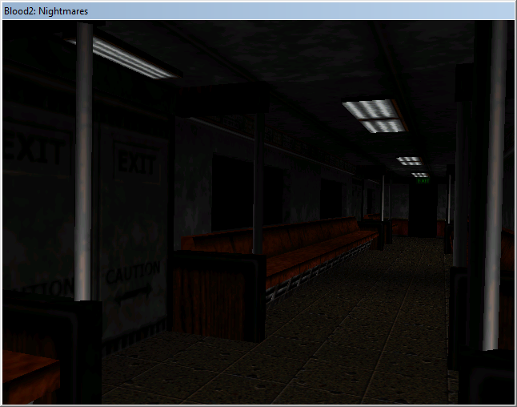

# d_ren - A LithTech 1 Renderer



Note:
- This is a personal project more about reverse engineering the interfaces than to create a modern renderer itself, you will find only horror and code-gore here.
- Requires a *test_texture.png* to load, it's not actually used but needs to exist to be loaded as a dummy during the menus for now (2021/07).
- There's a bunch of SDL references that do nothing but need to be removed, so you still need SDL2.dll to run it (2021/07).

## The Interesting Parts
*source/renderer_interface.d* and *source/object/xxx.d* are where the most useful parts are for most people interested in working with LithTech 1.0, it should be trivial for anyone familiar with C-like languages to translate them from D to any preferred language.

## Building
Due to LithTech 1 being exclusively 32-bit, the renderer must be built in 32-bit: `dub build --arch="x86_mscoff"`, attempting to build in 64-bit will fail with one of the many static asserts I've placed to ensure correct alignments in shared structures.

Shaders can be compiled with something like the following if you have the Vulkan SDK installed:
```
glslc.exe shader.vert -o vert.spv
glslc.exe shader.frag -o frag.spv
```

## Why Vulkan?
I'm not familiar/comfortable with DirectX, but have a little experience with Vulkan before this, and because without hex editing the original exe (barring weird possible alternatives which I probably left in a comment somewhere in the code) an OpenGL context can't be created in the window we're given.

Uses [ErupteD](https://github.com/ParticlePeter/ErupteD) as the binding.

## This Code is Garbage and Runs Terribly!
Yes. See the first note above; there's a lot of text flushing every frame to make sure I get the information I want written when I cause a crash trying to discover new things.

I also did a 5 minute hack change to make textures work *right now* that obliterated Vulkan's performance, and haven't really given any thought to restructuring everything to support a more modern rendering style.